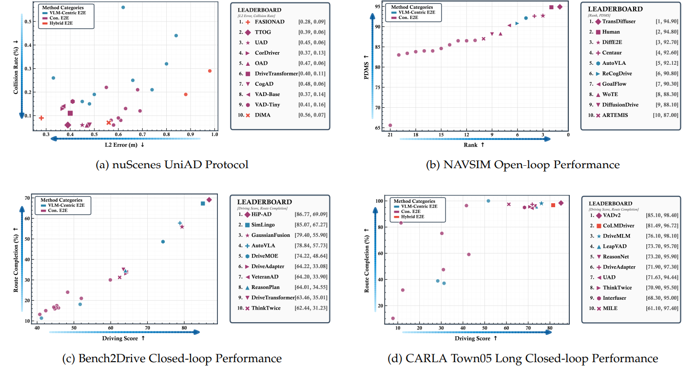

<div id="top">

# Awesome-GE2EAD

<!-- PROJECT SHIELDS -->
[](https://github.com/sindresorhus/awesome)
[](https://www.techrxiv.org/doi/full/10.36227/techrxiv.176523315.56439138/v2)
[](https://autolab-sai-sjtu.github.io/GE2EAD/)
[](https://github.com/AutoLab-SAI-SJTU/GE2EAD/network/members)


This is the official repository for **"Survey of General End-to-End Autonomous Driving: A Unified Perspective"**.

This project aims to provide a unified roadmap for the field by:

- 🗂️ **Literature Taxonomy**: Classifying methods into Conventional (e.g., UniAD), VLM-centric (e.g., DriveLM), and Hybrid (e.g., Senna) approaches.

- 💾 **Dataset Curation**: Collecting both Standard and Vision-Language datasets relevant to end-to-end AD.

- 📈 **Trend Analysis**: Outlining main research branches and emerging trends based on our survey.

<div align="center">
  <a href="https://github.com/AutoLab-SAI-SJTU/GE2EAD">
    
  </a>
  <h3 align="center"></h3>
</div>

## Citation
If you find this project useful in your research, please consider citing:
```BibTeX
@article{yang2025survey,
  title={Survey of General End-to-End Autonomous Driving: A Unified Perspective},
  author={Yang, Yixiang and Han, Chuanrong and Mao, Runhao and others},
  journal={TechRxiv},
  year={2025},
  month={December},
  doi={10.36227/techrxiv.176523315.56439138/v1},
  url={https://doi.org/10.36227/techrxiv.176523315.56439138/v1}
}
```

## 📌 Milestones

- 🚀 **2025-12-24**: We organize the list of papers in a completely new tabular format.

- 🚀 **2025-12-10**: The paper *“Survey of General End-to-End Autonomous Driving: A Unified Perspective”* was released, and this repository was made publicly available.


## Table of Contents

- [Mindmap, Top Methods](#mindmap-top-methods)
- [Papers](#papers)
    - [Conventional End-to-End Methods](#conventional-end-to-end-methods)
    - [VLM-Centric End-to-End Methods](#vlm-centric-end-to-end-methods)
    - [Hybrid End-to-End Methods](#hybrid-end-to-end-methods)
- [Dataset](#dataset)
    - [Normal Dataset](#normal-dataset)
    - [Vision Language Dataset](#vision-language-dataset)
- [License](#license)
- [Citation](#citation)

## Mindmap, Top Methods

<div align="center">
  <a href="https://github.com/AutoLab-SAI-SJTU/GE2EAD">
    
  </a>
  <h3 align="center">GE2EAD Mindmap</h3>
</div>

<div align="center">
  <a href="https://github.com/AutoLab-SAI-SJTU/GE2EAD">
    
  </a>
  <h3 align="center">Top Methods</h3>
</div>

## Papers
<details open>
<summary> Conventional End-to-End Methods </summary>

### Conventional End-to-End Methods

<details open>
<summary>2025</summary>

| 🧠 **Method** | 🗓️ **Year / Venue** | 🏷️ **Tags** | 📄 **Paper** | 💻 **GitHub** | 🌐 **Project** |
|---|---|---|---|---|---|
| **FutureX**<br><sub>FutureX: Enhance End-to-End Autonomous Driving via Latent Chain-of-Thought World Model</sub> | 2025 | `World Model` · `Latent CoT` | [](https://arxiv.org/abs/2512.11226) | — | — |
| **Spatial Retrieval AD**<br><sub>Spatial Retrieval Augmented Autonomous Driving</sub> | 2025 | `Retrieval` · `Geo Images` | [](https://arxiv.org/abs/2512.06865v1) | [](https://github.com/SpatialRetrievalAD/SpatialRetrievalAD-Dataset-Devkit) | [Project](https://spatialretrievalad.github.io/) |
| **UniMM-V2X**<br><sub>UniMM-V2X: MoE-Enhanced Multi-Level Fusion for End-to-End Cooperative Autonomous Driving</sub> | 2025 | `MoE` · `Multi-Agent`| [](https://www.arxiv.org/abs/2511.09013) | [](https://github.com/Souig/UniMM-V2X) | — |
| **UniLION**<br><sub>UniLION: Towards Unified Autonomous Driving Model with Linear Group RNNs</sub> | 2025 | `Linear RNN` | [](https://arxiv.org/abs/2511.01768) | [](https://github.com/happinesslz/UniLION) | — |
| **DiffusionDriveV2**<br><sub>DiffusionDriveV2: Reinforcement Learning-Constrained Truncated Diffusion Modeling in End-to-End Autonomous Driving</sub> | 2025 | `Diffusion` · `RL` | [](https://arxiv.org/abs/2512.07745) | [](https://github.com/hustvl/DiffusionDriveV2) | — |
| **SIMSCALE**<br><sub>SimScale: Learning to Drive via Real-World Simulation at Scale</sub> | 2025 | `Simulation` · `Data Gen` | [](https://arxiv.org/abs/2511.23369) | [](https://github.com/OpenDriveLab/SimScale) | — |
| **LAP**<br><sub>LAP: Fast Latent Diffusion Planner with Fine-Grained Feature Distillation for Autonomous Driving</sub> | 2025 | `Latent Diffusion` · `Planning` | [](https://arxiv.org/abs/2512.00470) | [](https://github.com/jhz1192/Latent-Planner) | — |
| **GuideFlow**<br><sub>GuideFlow: Constraint-Guided Flow Matching for Planning in End-to-End Autonomous Driving</sub> | 2025 | `Generative` · `Flow Matching` | [](https://arxiv.org/abs/2511.18729) | [](https://github.com/liulin815/GuideFlow) | — |
| **DiffRefiner**<br><sub>DiffRefiner: Coarse to Fine Trajectory Planning via Diffusion Refinement with Semantic Interaction for End to End Autonomous Driving</sub> | 2025 | `Diffusion` · `Refinement` | [](https://arxiv.org/abs/2511.17150) | [](https://github.com/nullmax-vision/DiffRefiner) | — |
| **ResAD**<br><sub>ResAD: Normalized Residual Trajectory Modeling for End-to-End Autonomous Driving</sub> | 2025 | `Trajectory Modeling` | [](https://arxiv.org/abs/2510.08562) | [](https://github.com/Duckyee728/ResAD-released) | — |
| **SeerDrive**<br><sub>Future-Aware End-to-End Driving: Bidirectional Modeling of Trajectory Planning and Scene Evolution</sub> | NeurIPS 2025 | `World Model` · `Planning` | [](https://arxiv.org/abs/2510.11092) | [](https://github.com/LogosRoboticsGroup/SeerDrive) | — |
| **DriveDPO**<br><sub>DriveDPO: Policy Learning via Safety DPO For End-to-End Autonomous Driving</sub> | 2025 | `DPO` · `Safety` | [](https://arxiv.org/abs/2509.17940) | — | — |
| **AnchDrive**<br><sub>AnchDrive: Bootstrapping Diffusion Policies with Hybrid Trajectory Anchors for End-to-End Driving</sub> | 2025 | `Diffusion` · `Anchors` | [](https://arxiv.org/abs/2509.20253) | — | — |
| **AdaThinkDrive**<br><sub>AdaThinkDrive: Adaptive Thinking via Reinforcement Learning for Autonomous Driving</sub> | 2025 | `RL` · `CoT` | [](https://arxiv.org/abs/2509.13769) | — | — |
| **VeteranAD**<br><sub>Perception in Plan: Coupled Perception and Planning for End-to-End Autonomous Driving</sub> | 2025 | `Perception-Planning` | [](https://arxiv.org/abs/2508.11488) | [](https://github.com/LogosRoboticsGroup/VeteranAD) | — |
| **EvaDrive**<br><sub>Evolutionary Adversarial Policy Optimization for End-to-End Autonomous Driving</sub> | 2025 | `RL` · `Adversarial` | [](https://arxiv.org/abs/2508.09158) | — | — |
| **ReconDreamer-RL**<br><sub>Enhancing Reinforcement Learning via Diffusion-based Scene Reconstruction</sub> | 2025 | `RL` · `World Model` | [](https://arxiv.org/abs/2508.08170) | [](https://github.com/GigaAI-research/ReconDreamer-RL) | — |
| **GMF-Drive**<br><sub>Gated Mamba Fusion with Spatial-Aware BEV Representation for End-to-End Autonomous Driving</sub> | 2025 | `Mamba` · `Fusion` | [](https://arxiv.org/abs/2508.06113) | — | — |
| **DistillDrive**<br><sub>End-to-End Multi-Mode Autonomous Driving Distillation by Isomorphic Hetero-Source Planning Model</sub> | 2025 | `Distillation` | [](https://arxiv.org/abs/2508.05402) | [](https://github.com/YuruiAI/DistillDrive) | — |
| **GEMINUS**<br><sub>Dual-aware Global and Scene-Adaptive Mixture-of-Experts for End-to-End Autonomous Driving</sub> | 2025 | `MoE` · `Adaptive` | [](https://arxiv.org/abs/2507.14456) | [](https://github.com/newbrains1/GEMINUS) | — |
| **DiVER**<br><sub>Breaking Imitation Bottlenecks: Reinforced Diffusion Powers Diverse Trajectory Generation</sub> | 2025 | `RL` · `Diffusion` | [](https://arxiv.org/abs/2507.04049) | — | — |
| **World4Drive**<br><sub>End-to-End Autonomous Driving via Intention-aware Physical Latent World Model</sub> | ICCV 2025 | `World Model` | [](https://arxiv.org/abs/2507.00603) | [](https://github.com/ucaszyp/World4Drive) | — |
| **FocalAD**<br><sub>Local Motion Planning for End-to-End Autonomous Driving</sub> | 2025 | `Motion Planning` | [](https://arxiv.org/abs/2506.11419) | — | — |
| **GaussianFusion**<br><sub>Gaussian-Based Multi-Sensor Fusion for End-to-End Autonomous Driving</sub> | 2025 | `Gaussian Splatting` · `Fusion` | [](https://arxiv.org/abs/2506.00034) | [](https://github.com/Say2L/GaussianFusion) | — |
| **CogAD**<br><sub>Cognitive-Hierarchy Guided End-to-End Autonomous Driving</sub> | 2025 | `Cognitive` · `Hierarchy` | [](https://arxiv.org/abs/2505.21581) | — | — |
| **DiffE2E**<br><sub>Rethinking End-to-End Driving with a Hybrid Action Diffusion and Supervised Policy</sub> | 2025 | `Diffusion` · `Hybrid` | [](https://arxiv.org/abs/2505.19516) | — | [Project](https://infinidrive.github.io/DiffE2E/) |
| **TransDiffuser**<br><sub>End-to-end Trajectory Generation with Decorrelated Multi-modal Representation for Autonomous Driving</sub> | 2025 | `Diffusion` · `Multimodal` | [](https://arxiv.org/abs/2505.09315) | — | — |
| **MomAD**<br><sub>Don’t Shake the Wheel: Momentum-Aware Planning in End-to-End Autonomous Driving</sub> | CVPR 2025 | `Planning` · `Momentum` | [](https://arxiv.org/abs/2503.03125) | [](https://github.com/adept-thu/MomAD) | — |
| **Consistency**<br><sub>Predictive Planner for Autonomous Driving with Consistency Models</sub> | 2025 | `Consistency` · `Planning` | [](https://arxiv.org/abs/2502.08033) | — | — |
| **ARTEMIS**<br><sub>Autoregressive End-to-End Trajectory Planning with Mixture of Experts for Autonomous Driving</sub> | 2025 | `MoE` · `Autoregressive` | [](https://arxiv.org/abs/2504.19580) | — | — |
| **TTOG**<br><sub>Two Tasks, One Goal: Uniting Motion and Planning for Excellent End To End Autonomous Driving Performance</sub> | 2025 | `Multi-task` | [](https://arxiv.org/abs/2504.12667) | — | — |
| **DiffusionDrive**<br><sub>Truncated Diffusion Model for End-to-End Autonomous Driving</sub> | CVPR 2025 | `Diffusion` | [](https://arxiv.org/abs/2411.15139) | [](https://github.com/hustvl/DiffusionDrive) | — |
| **WoTE**<br><sub>End-to-End Driving with Online Trajectory Evaluation via BEV World Model</sub> | 2025 | `World Model` · `BEV` | [](https://arxiv.org/abs/2504.01941) | [](https://github.com/liyingyanUCAS/WoTE) | — |
| **DMAD**<br><sub>Divide and Merge: Motion and Semantic Learning in End-to-End Autonomous Driving</sub> | 2025 | `Multi-task` | [](https://arxiv.org/abs/2502.07631) | [](https://github.com/shenyinzhe/DMAD) | — |
| **Centaur**<br><sub>Robust End-to-End Autonomous Driving with Test-Time Training</sub> | 2025 | `Test-Time Training` | [](https://arxiv.org/abs/2503.11650) | — | — |
| **Drive in Corridors**<br><sub>Enhancing the Safety of End-to-end Autonomous Driving via Corridor Learning and Planning</sub> | 2025 | `Safety` · `Planning` | [](https://arxiv.org/abs/2504.07507) | — | — |
| **BridgeAD**<br><sub>Bridging Past and Future: End-to-End Autonomous Driving with Historical Prediction and Planning</sub> | CVPR 2025 | `Prediction` · `Planning` | [](https://arxiv.org/abs/2503.14182) | [](https://github.com/fudan-zvg/BridgeAD) | — |
| **Hydra-MDP++**<br><sub>Advancing End-to-End Driving via Expert-Guided Hydra-Distillation</sub> | 2025 | `Distillation` · `Multi-head` | [](https://arxiv.org/abs/2503.12820) | [](https://github.com/NVlabs/Hydra-MDP) | — |
| **DiffAD**<br><sub>A Unified Diffusion Modeling Approach for Autonomous Driving</sub> | 2025 | `Diffusion` | [](https://arxiv.org/abs/2503.12170) | — | — |
| **GoalFlow**<br><sub>Goal-Driven Flow Matching for Multimodal Trajectories Generation in End-to-End Autonomous Driving</sub> | CVPR 2025 | `Flow Matching` | [](https://arxiv.org/abs/2503.05689) | [](https://github.com/YvanYin/GoalFlow) | — |
| **HiP-AD**<br><sub>Hierarchical and Multi-Granularity Planning with Deformable Attention for Autonomous Driving in a Single Decoder</sub> | ICCV 2025 | `Attention` · `Planning` | [](https://arxiv.org/abs/2503.08612) | [](https://github.com/nullmax-vision/HiP-AD) | — |
| **LAW**<br><sub>Enhancing End-to-End Autonomous Driving with Latent World Model</sub> | ICLR 2025 | `World Model` | [](https://arxiv.org/abs/2406.08481) | [](https://github.com/BraveGroup/LAW) | — |
| **DriveTransformer**<br><sub>Unified Transformer for Scalable End-to-End Autonomous Driving</sub> | ICLR 2025 | `Transformer` | [](https://arxiv.org/abs/2503.07656) | [](https://github.com/Thinklab-SJTU/DriveTransformer) | — |
| **UncAD**<br><sub>Towards Safe End-to-end Autonomous Driving via Online Map Uncertainty</sub> | ICRA 2025 | `Uncertainty` · `Map` | [](https://arxiv.org/abs/2504.12826) | [](https://github.com/pengxuanyang/UncAD) | — |
| **RAD**<br><sub>Training an End-to-End Driving Policy via Large-Scale 3DGS-based Reinforcement Learning</sub> | 2025 | `RL` · `3DGS` | [](https://arxiv.org/abs/2502.13144) | — | [Project](https://hgao-cv.github.io/RAD/) |
| **OAD**<br><sub>Trajectory Offset Learning: A Framework for Enhanced End-to-End Autonomous Driving</sub> | 2025 | `Trajectory` · `Offset` | [](https://www.researchgate.net/publication/388891609_Trajectory_Offset_Learning_A_Framework_for_Enhanced_End-to-End_Autonomous_Driving) | [](https://github.com/wzn-cv/OAD) | — |

</details>
<details open>
<summary>2024</summary>

| 🧠 **Method** | 🗓️ **Year / Venue** | 🏷️ **Tags** | 📄 **Paper** | 💻 **GitHub** | 🌐 **Project** |
|---|---|---|---|---|---|
| **GaussianAD**<br><sub>Gaussian-Centric End-to-End Autonomous Driving</sub> | 2024 | `Gaussian Splatting` · `Perception` | [](https://arxiv.org/abs/2412.10371) | [](https://github.com/wzzheng/GaussianAD) | — |
| **MA2T**<br><sub>Module-wise Adaptive Adversarial Training for End-to-end Autonomous Driving</sub> | 2024 | `Adversarial` · `Robustness` | [](https://arxiv.org/abs/2409.07321) | — | — |
| **Hint-AD**<br><sub>Holistically Aligned Interpretability in End-to-End Autonomous Driving</sub> | 2024 | `Interpretability` · `Alignment` | [](https://arxiv.org/abs/2409.06702) | [](https://github.com/Robot-K/Hint-AD) | [Project](https://air-discover.github.io/Hint-AD/) |
| **DRAMA**<br><sub>An Efficient End-to-end Motion Planner for Autonomous Driving with Mamba</sub> | CVPR 2025 | `Mamba` · `Motion Planning` | [](https://arxiv.org/abs/2408.03601) | [](https://github.com/Chengran-Yuan/DRAMA) | [Project](https://chengran-yuan.github.io/DRAMA/) |
| **PPAD**<br><sub>Iterative Interactions of Prediction and Planning for End-to-end Autonomous Driving</sub> | ECCV 2024 | `Prediction` · `Planning` | [](https://arxiv.org/abs/2311.08100) | [](https://github.com/zlichen/PPAD) | — |
| **BEV-Planner**<br><sub>Is Ego Status All You Need for Open-Loop End-to-End Autonomous Driving?</sub> | CVPR 2024 | `BEV` · `Evaluation` | [](https://arxiv.org/abs/2312.03031) | [](https://github.com/NVlabs/BEV-Planner) | — |
| **EfficientFuser**<br><sub>Efficient Fusion and Task Guided Embedding for End-to-end Autonomous Driving</sub> | 2024 | `Efficient` · `Fusion` | [](https://arxiv.org/abs/2407.02878) | — | — |
| **UAD**<br><sub>End-to-End Autonomous Driving without Costly Modularization and 3D Manual Annotation</sub> | 2024 | `Unsupervised` | [](https://arxiv.org/abs/2406.17680) | — | — |
| **Hydra-MDP**<br><sub>End-to-end Multimodal Planning with Multi-target Hydra-Distillation</sub> | 2024 | `Distillation` · `Multimodal` | [](https://arxiv.org/abs/2406.06978) | [](https://github.com/NVlabs/Hydra-MDP) | — |
| **DualAD**<br><sub>Disentangling the Dynamic and Static World for End-to-End Driving</sub> | CVPR 2025 | `Dual-Stream` · `Dynamic` | [](https://arxiv.org/abs/2406.06264) | [](https://github.com/TUM-AVS/DualAD) | — |
| **SparseDrive**<br><sub>End-to-End Autonomous Driving via Sparse Scene Representation</sub> | 2024 | `Sparse` · `Scene Rep` | [](https://arxiv.org/abs/2405.19620) | [](https://github.com/swc-17/SparseDrive) | — |
| **GAD**<br><sub>GAD-Generative Learning for HD Map-Free Autonomous Driving</sub> | 2024 | `Generative` · `Map-Free` | [](https://arxiv.org/abs/2405.00515) | [](https://github.com/mr-d-self-driving/GAD) | — |
| **SparseAD**<br><sub>Sparse Query-Centric Paradigm for Efficient End-to-End Autonomous Driving</sub> | 2024 | `Sparse` · `Query` | [](https://arxiv.org/abs/2404.06892) | — | — |
| **GenAD**<br><sub>Generative End-to-End Autonomous Driving</sub> | ECCV 2024 | `Generative` · `Prediction` | [](https://arxiv.org/abs/2402.11502) | [](https://github.com/wzzheng/GenAD) | — |
| **GraphAD**<br><sub>Interaction Scene Graph for End-to-end Autonomous Driving</sub> | 2024 | `Graph` · `Interaction` | [](https://arxiv.org/abs/2403.19098) | [](https://github.com/zhangyp15/GraphAD) | — |
| **ActiveAD**<br><sub>Planning-Oriented Active Learning for End-to-End Autonomous Driving</sub> | 2024 | `Active Learning` | [](https://arxiv.org/abs/2403.02877) | — | — |
| **VADv2**<br><sub>End-to-End Vectorized Autonomous Driving via Probabilistic Planning</sub> | 2024 | `Vectorized` · `Probabilistic` | [](https://arxiv.org/abs/2402.13243) | [](https://github.com/hustvl/vad) | — |

</details>

<details open>
<summary>2023</summary>

| 🧠 **Method** | 🗓️ **Year / Venue** | 🏷️ **Tags** | 📄 **Paper** | 💻 **GitHub** | 🌐 **Project** |
|---|---|---|---|---|---|
| **DriveAdapter**<br><sub>Breaking the Coupling Barrier of Perception and Planning in End-to-End Autonomous Driving</sub> | ICCV 2023 | `Adapter` · `Decoupling` | [](https://arxiv.org/abs/2308.00398) | [](https://github.com/OpenDriveLab/DriveAdapter) | — |
| **VAD**<br><sub>Vectorized Scene Representation for Efficient Autonomous Driving</sub> | ICCV 2023 | `Vectorized` · `Efficient` | [](https://arxiv.org/abs/2303.12077) | [](https://github.com/hustvl/VAD) | — |
| **ThinkTwice**<br><sub>Think Twice before Driving: Towards Scalable Decoders for End-to-End Autonomous Driving</sub> | CVPR 2023 | `Decoder` · `Refinement` | [](https://arxiv.org/abs/2305.06242) | [](https://github.com/OpenDriveLab/ThinkTwice) | — |
| **ReasonNet**<br><sub>End-to-End Driving with Temporal and Global Reasoning</sub> | CVPR 2023 | `Reasoning` · `Temporal` | [](https://arxiv.org/abs/2305.10507) | [](https://github.com/opendilab/DOS) | — |
| **SuperDriverAI**<br><sub>Towards Design and Implementation for End-to-End Learning-based Autonomous Driving</sub> | 2023 | `Attention` · `DNN` | [](https://arxiv.org/abs/2305.10443) | — | — |
| **UniAD**<br><sub>Planning-oriented Autonomous Driving</sub> | CVPR 2023 | `Multi-task` · `Unified` | [](https://arxiv.org/abs/2212.10156) | [](https://github.com/OpenDriveLab/UniAD) | — |
| **E2E Dense**<br><sub>End-to-End Learning of Behavioural Inputs for Autonomous Driving in Dense Traffic</sub> | IROS 2023 | `Optimization` · `Dense Traffic` | [](https://arxiv.org/abs/2310.14766) | — | — |
| **CRCHFL**<br><sub>Communication Resources Constrained Hierarchical Federated Learning for End-to-End Autonomous Driving</sub> | IROS 2023 | `Federated Learning` | [](https://arxiv.org/abs/2306.16169) | — | — |
| **PPGeo**<br><sub>Policy pre-training for autonomous driving via self-supervised geometric modeling</sub> | ICLR 2023 | `Self-Supervised` · `Geometric` | [](https://arxiv.org/abs/2301.01006) | [](https://github.com/OpenDriveLab/PPGeo) | — |

</details>

<details open>
<summary>Before 2023</summary>

| 🧠 **Method** | 🗓️ **Year / Venue** | 🏷️ **Tags** | 📄 **Paper** | 💻 **GitHub** | 🌐 **Project** |
|---|---|---|---|---|---|
| **MMFN**<br><sub>Multi-Modal-Fusion-Net for End-to-End Driving</sub> | IROS 2022 | `Fusion` · `Multi-Modal` | [](https://arxiv.org/abs/2207.00186) | [](https://github.com/Kin-Zhang/mmfn) | — |
| **KEMP**<br><sub>Keyframe-Based Hierarchical End-to-End Deep Model for Long-Term Trajectory Prediction</sub> | ICRA 2022 | `Keyframe` · `Hierarchical` | [](https://arxiv.org/abs/2205.04624) | — | — |
| **TCP**<br><sub>Trajectory-guided Control Prediction for End-to-end Autonomous Driving: A Simple yet Strong Baseline</sub> | NeurIPS 2022 | `Trajectory` · `Control` | [](https://arxiv.org/abs/2206.08129) | [](https://github.com/OpenPerceptionX/TCP) | — |
| **ST-P3**<br><sub>End-to-end Vision-based Autonomous Driving via Spatial-Temporal Feature Learning</sub> | ECCV 2022 | `Spatial-Temporal` · `Interpretable` | [](https://arxiv.org/abs/2207.07601) | [](https://github.com/OpenDriveLab/ST-P3) | — |
| **MP3**<br><sub>A Unified Model to Map, Perceive, Predict and Plan</sub> | CVPR 2021 | `Mapless` · `Prediction` | [Paper](https://openaccess.thecvf.com/content/CVPR2021/papers/Casas_MP3_A_Unified_Model_To_Map_Perceive_Predict_and_Plan_CVPR_2021_paper.pdf) | — | — |
| **Multitask**<br><sub>Multi-task Learning with Attention for End-to-end Autonomous Driving</sub> | CVPR 2021 | `Multi-task` · `Attention` | [](https://arxiv.org/abs/2104.10753) | [](https://github.com/KeishiIshihara/multitask-with-attention) | — |
| **Transfuser**<br><sub>Multi-Modal Fusion Transformer for End-to-End Autonomous Driving</sub> | CVPR 2021 | `Transformer` · `Fusion` | [Paper](https://openaccess.thecvf.com/content/CVPR2021/papers/Prakash_Multi-Modal_Fusion_Transformer_for_End-to-End_Autonomous_Driving_CVPR_2021_paper.pdf) | [](https://github.com/autonomousvision/transfuser) | — |
| **NEAT**<br><sub>Neural Attention Fields for End-to-End Autonomous Driving</sub> | ICCV 2021 | `Attention Fields` · `BEV` | [Paper](https://openaccess.thecvf.com/content/ICCV2021/papers/Chitta_NEAT_Neural_Attention_Fields_for_End-to-End_Autonomous_Driving_ICCV_2021_paper.pdf) | [](https://github.com/autonomousvision/neat) | — |
| **Fast-LiDARNet**<br><sub>Efficient and Robust LiDAR-Based End-to-End Navigation</sub> | ICRA 2021 | `LiDAR` · `Efficient` | [](https://arxiv.org/abs/2105.09932) | — | — |
| **IVMP**<br><sub>Learning Interpretable End-to-End Vision-Based Motion Planning for Autonomous Driving with Optical Flow Distillation</sub> | ICRA 2021 | `Interpretable` · `Optical Flow` | [](https://arxiv.org/abs/2104.12861) | — | [Project](https://sites.google.com/view/ivmp) |
| **P3**<br><sub>Perceive, Predict, and Plan: Safe Motion Planning Through Interpretable Semantic Representations</sub> | ECCV 2020 | `Semantic` · `Interpretability` | [](https://arxiv.org/abs/2008.05930) | — | — |
| **DARB**<br><sub>Exploring data aggregation in policy learning for vision-based urban autonomous driving</sub> | CVPR 2020 | `Data Aggregation` · `Policy` | [Paper](https://openaccess.thecvf.com/content_CVPR_2020/papers/Prakash_Exploring_Data_Aggregation_in_Policy_Learning_for_Vision-Based_Urban_Autonomous_CVPR_2020_paper.pdf) | [](https://github.com/autonomousvision/data_aggregation) | — |
| **Roach**<br><sub>End-to-End Urban Driving by Imitating a Reinforcement Learning Coach</sub> | ICCV 2021 | `RL` · `Imitation` | [](https://arxiv.org/abs/2108.08265) | [](https://github.com/zhejz/carla-roach) | — |
| **LBC**<br><sub>Learning by cheating</sub> | CoRL 2019 | `Knowledge Distillation` | [](https://arxiv.org/abs/1912.12294) | [](https://github.com/dotchen/LearningByCheating) | — |
| **CIL**<br><sub>End-to-End driving via conditional imitation learning</sub> | CoRL 2018 | `Imitation Learning` | [](https://arxiv.org/abs/1710.02410) | [](https://github.com/carla-simulator/imitation-learning) | — |
| **Drive in A Day**<br><sub>Learning to drive in a day</sub> | 2018 | `RL` | [](https://arxiv.org/abs/1807.00412) | [](https://github.com/sheelabhadra/Learning2Drive) | — |
| **CNN E2E**<br><sub>End to End Learning for Self-Driving Cars</sub> | 2016 | `CNN` · `Imitation` | [](https://arxiv.org/abs/1604.07316) | [](https://github.com/Nuclearstar/End-to-End-Learning-for-Self-Driving-Cars) | — |
| **ALVINN**<br><sub>An autonomous land vehicle in a neural network</sub> | NeurIPS 1988 | `Neural Network` | [Paper](https://proceedings.neurips.cc/paper/1988/file/812b4ba287f5ee0bc9d43bbf5bbe87fb-Paper.pdf) | — | — |

</details>


<p align="right">(<a href="#top">back to top</a>)</p>    
</details>

<details open>
<summary>VLM-Centric End-to-End Methods</summary>


### VLM-Centric End-to-End Methods

<details open>
<summary>2025</summary>

| 🧠 **Method** | 🗓️ **Year / Venue** | 🏷️ **Tags** | 📄 **Paper** | 💻 **GitHub** | 🌐 **Project** |
|---|---|---|---|---|---|
| **DrivePI**<br><sub>DrivePI: Spatial-aware 4D MLLM for Unified Autonomous Driving Understanding, Perception, Prediction and Planning</sub> | 2025 | `4D Spatial` · `Occupancy`  | [](https://arxiv.org/abs/2512.12799) | [](https://github.com/happinesslz/DrivePI) | — |
| **WAM-Diff**<br><sub>WAM-Diff: A Masked Diffusion VLA Framework with MoE and Online Reinforcement Learning for Autonomous Driving</sub> | 2025 | `Masked Diffusion` · `MoE` · `Online RL` | [](https://arxiv.org/abs/2512.11872) | [](https://github.com/fudan-generative-vision/WAM-Diff) | — |
| **SpaceDrive**<br><sub>SpaceDrive: Infusing Spatial Awareness into VLM-based Autonomous Driving</sub> | 2025 | `Spatial Encoding` | [](https://arxiv.org/abs/2512.10719) | [](https://github.com/zhenghao2519/SpaceDrive) | [Project](https://zhenghao2519.github.io/SpaceDrive_Page/) |
| **WAM-Flow**<br><sub>WAM-Flow: Parallel Coarse-to-Fine Motion Planning via Discrete Flow Matching for Autonomous Driving</sub> | 2025 | `VLA` · `Online RL` · `Discrete Flow Matching` | [](https://arxiv.org/abs/2512.06112) | [](https://github.com/fudan-generative-vision/WAM-Flow) | — |
| **OpenREAD**<br><sub>OpenREAD: Reinforced Open-Ended Reasoning for End-to-End Autonomous Driving with LLM-as-Critic</sub> | 2025 | `RFT/RL` · `LLM-as-Critic` | [](https://arxiv.org/abs/2512.01830) | [](https://github.com/wyddmw/OpenREAD) |
| **CoT4AD**<br><sub>CoT4AD: A Vision-Language-Action Model with Explicit Chain-of-Thought Reasoning</sub> | 2025 | `VLA` · `CoT` | [](https://arxiv.org/abs/2511.22532) | — | — |
| **MPA**<br><sub>Model-Based Policy Adaptation for Closed-Loop End-to-End Autonomous Driving</sub> | NeurIPS 2025 | `Model-Based` · `Sim` | [](https://arxiv.org/abs/2511.21584) | — | [Project](https://mpa-drive.github.io/) |
| **AD-R1**<br><sub>AD-R1: Closed-Loop Reinforcement Learning with Impartial World Models</sub> | 2025 | `RL` · `World Model` | [](https://arxiv.org/abs/2511.20325) | — | — |
| **Alpamayo-R1**<br><sub>Alpamayo-R1: Bridging Reasoning and Action Prediction for Generalizable Autonomous Driving</sub> | 2025 | `VLA` · `Reasoning` | [](https://arxiv.org/abs/2511.00088) | [](https://github.com/NVlabs/alpamayo) | — |
| **DriveVLA-W0**<br><sub>DRIVEVLA-W0: World Models Amplify Data Scaling Law in Autonomous Driving</sub> | 2025 | `VLA` · `World Model` | [](https://arxiv.org/abs/2510.12796) | [](https://github.com/BraveGroup/DriveVLA-W0) | — |
| **MTRDrive**<br><sub>MTRDrive: Memory-Tool Synergistic Reasoning for Robust Autonomous Driving</sub> | 2025 | `VLM` · `Memory` | [](https://arxiv.org/abs/2509.20843) | — | — |
| **ReflectDrive**<br><sub>Discrete Diffusion for Reflective Vision-Language-Action Models in Autonomous Driving</sub> | 2025 | `Diffusion` · `VLA` | [](https://arxiv.org/abs/2509.20109) | — | — |
| **IRL-VLA**<br><sub>IRL-VLA: Training an Vision-Language-Action Policy via Reward World Model</sub> | 2025 | `IRL` · `VLA` | [](https://arxiv.org/abs/2508.06571) | [](https://github.com/IRL-VLA/IRL-VLA) | — |
| **Prune2Drive**<br><sub>Prune2Drive: A Plug-and-Play Framework for Accelerating Vision-Language Models</sub> | 2025 | `VLM` · `Pruning` | [](https://arxiv.org/abs/2508.13305) | — | — |
| **FastDriveVLA**<br><sub>FastDriveVLA: Efficient End-to-End Driving via Plug-and-Play Reconstruction-based Token Pruning</sub> | 2025 | `VLA` · `Pruning` | [](https://arxiv.org/abs/2507.23318) | — | — |
| **MCAM**<br><sub>Multimodal Causal Analysis Model for Ego-Vehicle-Level Driving Video Understanding</sub> | 2025 | `Causal` · `Multimodal` | [](https://arxiv.org/abs/2507.06072) | [](https://github.com/SixCorePeach/MCAM) | — |
| **AutoDrive-R²**<br><sub>Incentivizing Reasoning and Self-Reflection Capacity for VLA Model in Autonomous Driving</sub> | 2025 | `VLA` · `Reflection` | [](https://arxiv.org/abs/2509.01944) | — | — |
| **DriveAgent-R1**<br><sub>Advancing VLM-based Autonomous Driving with Hybrid Thinking and Active Perception</sub> | 2025 | `VLM` · `Active` | [](https://arxiv.org/abs/2507.20879) | — | — |
| **NavigScene**<br><sub>Bridging Local Perception and Global Navigation for Beyond-Visual-Range Autonomous Driving</sub> | 2025 | `Navigation` · `Perception` | [](https://arxiv.org/abs/2507.05227) | — | — |
| **ADRD**<br><sub>LLM-DRIVEN AUTONOMOUS DRIVING BASED ON RULE-BASED DECISION SYSTEMS</sub> | 2025 | `LLM` · `Rule-Based` | [](https://arxiv.org/abs/2506.14299) | — | — |
| **AutoVLA**<br><sub>A Vision-Language-Action Model for End-to-End Autonomous Driving with Adaptive Reasoning</sub> | 2025 | `VLA` · `RL` | [](https://arxiv.org/abs/2506.13757) | [](https://github.com/ucla-mobility/AutoVLA) | [Project](https://autovla.github.io/) |
| **Poutine**<br><sub>Vision-Language-Trajectory Pre-Training and Reinforcement Learning Post-Training</sub> | 2025 | `VLT` · `RL` | [](https://arxiv.org/abs/2506.11234) | — | — |
| **ReCogDrive**<br><sub>A Reinforced Cognitive Framework for End-to-End Autonomous Driving</sub> | 2025 | `VLM` · `Diffusion` | [](https://arxiv.org/abs/2506.08052) | [](https://github.com/xiaomi-research/recogdrive) | [Project](https://xiaomi-research.github.io/recogdrive/) |
| **AD-EE**<br><sub>Early Exiting for Fast and Reliable Vision-Language Models in Autonomous Driving</sub> | 2025 | `VLM` · `Efficient` | [](https://arxiv.org/abs/2506.05404) | — | — |
| **FastDrive**<br><sub>Structured Labeling Enables Faster Vision-Language Models for End-to-End Autonomous Driving</sub> | 2025 | `VLM` · `Structured` | [](https://arxiv.org/abs/2506.05442) | — | — |
| **HMVLM**<br><sub>Multistage Reasoning-Enhanced Vision-Language Model for Long-Tailed Driving Scenarios</sub> | 2025 | `VLM` · `Long-Tail` | [](https://arxiv.org/abs/2506.05883) | — | — |
| **S4-Driver**<br><sub>Scalable Self-Supervised Driving Multimodal Large Language Model</sub> | CVPR 2025 | `Self-Supervised` · `MLLM` | [](https://openaccess.thecvf.com//content/CVPR2025/papers/Xie_S4-Driver_Scalable_Self-Supervised_Driving_Multimodal_Large_Language_Model_with_Spatio-Temporal_CVPR_2025_paper.pdf) | — | — |
| **DiffVLA**<br><sub>Vision-Language Guided Diffusion Planning for Autonomous Driving</sub> | 2025 | `Diffusion` · `VLM` | [](https://arxiv.org/abs/2505.19381) | — | — |
| **X-Driver**<br><sub>Explainable Autonomous Driving with Vision-Language Models</sub> | 2025 | `MLLM` · `CoT` | [](https://arxiv.org/abs/2505.05098) | — | — |
| **DriveGPT4-V2**<br><sub>Harnessing Large Language Model Capabilities for Enhanced Closed-Loop Autonomous Driving</sub> | CVPR 2025 | `LLM` · `Closed-Loop` | [](https://openaccess.thecvf.com//content/CVPR2025/papers/Xu_DriveGPT4-V2_Harnessing_Large_Language_Model_Capabilities_for_Enhanced_Closed-Loop_Autonomous_CVPR_2025_paper.pdf) | — | — |
| **DriveMind**<br><sub>A Dual-VLM based Reinforcement Learning Framework for Autonomous Driving</sub> | 2025 | `Dual-VLM` · `RL` | [](https://arxiv.org/abs/2506.00819) | — | — |
| **ReasonPlan**<br><sub>Unified Scene Prediction and Decision Reasoning for Closed-loop Autonomous Driving</sub> | 2025 | `MLLM` · `Reasoning` | [](https://arxiv.org/abs/2505.20024) | [](https://github.com/Liuxueyi/ReasonPlan) | — |
| **FutureSightDrive**<br><sub>Thinking Visually with Spatio-Temporal CoT for Autonomous Driving</sub> | 2025 | `CoT` · `Spatio-Temporal` | [](https://arxiv.org/abs/2505.17685) | [](https://github.com/missTL/FSDrive) | — |
| **PADriver**<br><sub>Towards Personalized Autonomous Driving</sub> | 2025 | `MLLM` · `Personalized` | [](https://arxiv.org/abs/2505.05240) | — | — |
| **LDM**<br><sub>Unlock the Power of Unlabeled Data in Language Driving Model</sub> | ICRA 2025 | `Self-Supervised` · `Distillation` | [](https://arxiv.org/abs/2503.10586) | — | — |
| **DriveMoE**<br><sub>Mixture-of-Experts for Vision-Language-Action Model in End-to-End Autonomous Driving</sub> | 2025 | `MoE` · `VLA` | [](https://arxiv.org/abs/2505.16278) | [](https://github.com/Thinklab-SJTU/DriveMoE) | [Project](https://thinklab-sjtu.github.io/DriveMoE/) |
| **DriveMonkey**<br><sub>Extending Large Vision-Language Model for Diverse Interactive Tasks in Autonomous Driving</sub> | 2025 | `LVLM` · `Interactive` | [](https://arxiv.org/abs/2505.08725) | [](https://github.com/zc-zhao/DriveMonkey) | — |
| **AgentThink**<br><sub>A Unified Framework for Tool-Augmented Chain-of-Thought Reasoning in Vision-Language Models</sub> | 2025 | `CoT` · `Tools` | [](https://arxiv.org/abs/2505.15298) | — | — |
| **DSDrive**<br><sub>Distilling Large Language Model for Lightweight End-to-End Autonomous Driving</sub> | 2025 | `Distillation` · `Lightweight` | [](https://arxiv.org/abs/2505.05360) | — | — |
| **LightEMMA**<br><sub>Lightweight End-to-end Multimodal Autonomous Driving</sub> | 2025 | `Lightweight` · `Multimodal` | [](https://arxiv.org/abs/2505.00284) | [](https://github.com/michigan-traffic-lab/LightEMMA) | — |
| **THCAD**<br><sub>Towards Human-Centric Autonomous Driving: A Fast-Slow Architecture Integrating LLM Guidance with RL</sub> | 2025 | `LLM` · `RL` · `Fast-Slow` | [](https://arxiv.org/abs/2505.06875) | — | — |
| **DriveSOTIF**<br><sub>Advancing Perception SOTIF Through Multimodal Large Language Models</sub> | 2025 | `SOTIF` · `MLLM` | [](https://arxiv.org/abs/2505.07084) | — | — |
| **Actor-Reasoner**<br><sub>Interact, Instruct to Improve: A LLM-Driven Parallel Actor-Reasoner Framework</sub> | 2025 | `LLM` · `Interaction` | [](https://arxiv.org/abs/2503.00502) | [](https://github.com/FanGShiYuu/Actor-Reasoner) | — |
| **MPDrive**<br><sub>Improving Spatial Understanding with Marker-Based Prompt Learning for Autonomous Driving</sub> | CVPR 2025 | `Prompt` · `Spatial` | [](https://arxiv.org/abs/2504.00379) | — | — |
| **V3LMA**<br><sub>Visual 3D-enhanced Language Model for Autonomous Driving</sub> | 2025 | `3D` · `LVLM` | [](https://arxiv.org/abs/2505.00156) | — | — |
| **OpenDriveVLA**<br><sub>Towards End-to-end Autonomous Driving with Large Vision Language Action Model</sub> | 2025 | `VLA` · `Open-Source` | [](https://arxiv.org/abs/2503.23463v1) | [](https://github.com/DriveVLA/OpenDriveVLA) | [Project](https://drivevla.github.io/) |
| **SimLingo**<br><sub>Vision-Only Closed-Loop Autonomous Driving with Language-Action Alignment</sub> | CVPR 2025 | `VLA` · `Closed-Loop` | [](https://openaccess.thecvf.com//content/CVPR2025/papers/Renz_SimLingo_Vision-Only_Closed-Loop_Autonomous_Driving_with_Language-Action_Alignment_CVPR_2025_paper.pdf) | [](https://github.com/RenzKa/simlingo) | [Project](https://www.katrinrenz.de/simlingo/) |
| **SAFEAUTO**<br><sub>KNOWLEDGE-ENHANCED SAFE AUTONOMOUS DRIVING WITH MULTIMODAL FOUNDATION MODELS</sub> | ICLR 2025 | `Safety` · `Multimodal` | [](https://arxiv.org/abs/2503.00211) | [](https://github.com/AI-secure/SafeAuto) | — |
| **NuGrounding**<br><sub>A Multi-View 3D Visual Grounding Framework in Autonomous Driving</sub> | 2025 | `Grounding` · `3D` | [](https://arxiv.org/abs/2503.22436) | — | — |
| **CoT-Drive**<br><sub>Efficient Motion Forecasting for Autonomous Driving with LLMs and Chain-of-Thought Prompting</sub> | 2025 | `CoT` · `Forecasting` | [](https://arxiv.org/abs/2503.07234) | — | — |
| **CoLMDriver**<br><sub>LLM-based Negotiation Benefits Cooperative Autonomous Driving</sub> | 2025 | `Cooperative` · `LLM` | [](https://arxiv.org/abs/2503.08683) | [](https://github.com/cxliu0314/CoLMDriver) | — |
| **AlphaDrive**<br><sub>Unleashing the Power of VLMs in Autonomous Driving via Reinforcement Learning and Reasoning</sub> | 2025 | `RL` · `Reasoning` | [](https://arxiv.org/abs/2503.07608) | [](https://github.com/hustvl/AlphaDrive) | — |
| **TrackingMeetsLMM**<br><sub>Tracking Meets Large Multimodal Models for Driving Scenario Understanding</sub> | 2025 | `Tracking` · `LMM` | [](https://arxiv.org/abs/2503.14498) | [](https://github.com/mbzuai-oryx/TrackingMeetsLMM) | — |
| **BEVDriver**<br><sub>Leveraging BEV Maps in LLMs for Robust Closed-Loop Driving</sub> | 2025 | `BEV` · `LLM` | [](https://arxiv.org/abs/2503.03074) | — | — |
| **DynRsl-VLM**<br><sub>Enhancing Autonomous Driving Perception with Dynamic Resolution Vision-Language Models</sub> | 2025 | `Dynamic Res` · `VLM` | [](https://arxiv.org/abs/2503.11265) | — | — |
| **Sce2DriveX**<br><sub>A Generalized MLLM Framework for Scene-to-Drive Learning</sub> | 2025 | `MLLM` · `Scene` | [](https://arxiv.org/abs/2502.14917) | — | — |
| **VLM-Assisted-CL**<br><sub>VLM-Assisted Continual learning for Visual Question Answering in Self-Driving</sub> | 2025 | `Continual Learning` | [](https://arxiv.org/abs/2502.00843) | — | — |
| **LeapVAD**<br><sub>A Leap in Autonomous Driving via Cognitive Perception and Dual-Process Thinking</sub> | 2025 | `Cognitive` · `Dual-Process` | [](https://arxiv.org/abs/2501.08168) | [](https://github.com/PJLab-ADG/LeapVAD) | [Project](https://pjlab-adg.github.io/LeapVAD/) |
</details>
<details open>
<summary>2024</summary>

| 🧠 **Method** | 🗓️ **Year / Venue** | 🏷️ **Tags** | 📄 **Paper** | 💻 **GitHub** | 🌐 **Project** |
|---|---|---|---|---|---|
| **VLM-RL**<br><sub>A Unified Vision Language Model and Reinforcement Learning Framework for Safe Autonomous Driving</sub> | 2024 | `RL` · `VLM` | [](https://arxiv.org/abs/2412.15544) | [](https://github.com/zihaosheng/VLM-RL) | [Project](https://www.huang-zilin.com/VLM-RL-website/) |
| **GPVL**<br><sub>Generative Planning with 3D-vision Language Pre-training for End-to-End Autonomous Driving</sub> | AAAI 2025 | `Generative` · `3D-VL` | [](https://arxiv.org/pdf/2501.08861) | [](https://github.com/ltp1995/GPVL) | — |
| **CALMM-Drive**<br><sub>Confidence-Aware Autonomous Driving with Large Multimodal Model</sub> | 2024 | `CoT` · `Confidence` | [](https://arxiv.org/abs/2412.04209) | — | — |
| **WiseAD**<br><sub>Knowledge Augmented End-to-End Autonomous Driving with Vision-Language Model</sub> | 2024 | `VLM` · `Reasoning` | [](https://arxiv.org/abs/2412.09951) | [](https://github.com/wyddmw/WiseAD) | — |
| **OpenEMMA**<br><sub>Open-Source Multimodal Model for End-to-End Autonomous Driving</sub> | WACV 2025 | `Open-Source` · `Multimodal` | [](https://arxiv.org/abs/2412.15208) | [](https://github.com/taco-group/OpenEMMA) | — |
| **FeD**<br><sub>Feedback-Guided Autonomous Driving</sub> | CVPR 2024 | `Feedback` · `LLM` | [Paper](https://fedaltothemetal.github.io/resources/FeD_v1.pdf) | — | [Project](https://fedaltothemetal.github.io/) |
| **LeapAD**<br><sub>Continuously learning, adapting, and improving: A dual-process approach to autonomous driving</sub> | NeurIPS 2024 | `Dual-Process` · `Continual` | [](https://arxiv.org/abs/2405.15324) | [](https://github.com/PJLab-ADG/LeapAD) | [Project](https://pjlab-adg.github.io/LeapAD/) |
| **DriveMM**<br><sub>All-in-One Large Multimodal Model for Autonomous Driving</sub> | 2024 | `Multimodal` · `Generalization` | [](https://arxiv.org/abs/2412.07689) | [](https://github.com/zhijian11/DriveMM) | [Project](https://zhijian11.github.io/DriveMM/) |
| **Exp-Planning**<br><sub>Explanation for Trajectory Planning using Multi-modal Large Language Model for Autonomous Driving</sub> | ECCV 2024 | `Explainability` · `Planning` | [](https://arxiv.org/abs/2411.09971) | — | — |
| **LaVida Drive**<br><sub>Vision-Text Interaction VLM for Autonomous Driving with Token Selection, Recovery and Enhancement</sub> | 2024 | `VQA` · `Interaction` | [](https://arxiv.org/abs/2411.12980) | — | — |
| **EMMA**<br><sub>End-to-End Multimodal Model for Autonomous Driving</sub> | 2024 | `End-to-End` · `Multimodal` | [](https://arxiv.org/abs/2410.23262) | — | — |
| **DriVLMe**<br><sub>Enhancing LLM-based Autonomous Driving Agents with Embodied and Social Experiences</sub> | IROS 2024 | `Embodied` · `Social` | [](https://arxiv.org/pdf/2406.03008) | [](https://github.com/sled-group/driVLMe/tree/main) | [Project](https://sled-group.github.io/driVLMe/) |
| **OccLLaMA**<br><sub>An Occupancy-Language-Action Generative World Model for Autonomous Driving</sub> | 2024 | `World Model` · `Occupancy` | [](https://arxiv.org/abs/2409.03272) | — | — |
| **MiniDrive**<br><sub>More Efficient Vision-Language Models with Multi-Level 2D Features as Text Tokens</sub> | 2024 | `Efficient` · `MoE` | [](https://arxiv.org/abs/2409.07267) | — | — |
| **RDA-Driver**<br><sub>Making Large Language Models Better Planners with Reasoning-Decision Alignment</sub> | ECCV 2024 | `Reasoning` · `Alignment` | [](https://arxiv.org/abs/2408.13890) | — | — |
| **EC-Drive**<br><sub>Edge-Cloud Collaborative Motion Planning for Autonomous Driving with Large Language Models</sub> | ICCT 2024 | `Edge-Cloud` · `Collaborative` | [](https://arxiv.org/abs/2408.09972) | — | [Project](https://sites.google.com/view/ec-drive) |
| **V2X-VLM**<br><sub>End-to-End V2X Cooperative Autonomous Driving Through Large Vision-Language Models</sub> | 2024 | `V2X` · `Cooperative` | [](https://arxiv.org/abs/2408.09251) | [](https://github.com/zilin-huang/V2X-VLM) | [Project](https://www.huang-zilin.com/V2X-VLM-website/) |
| **Cube-LLM**<br><sub>Language-Image Models with 3D Understanding</sub> | 2024 | `3D` · `Language-Image` | [](https://arxiv.org/abs/2405.03685) | — | [Project](https://janghyuncho.github.io/Cube-LLM/) |
| **VLM-MPC**<br><sub>Vision Language Foundation Model (VLM)-Guided Model Predictive Controller (MPC)</sub> | 2024 | `MPC` · `Control` | [](https://arxiv.org/abs/2408.04821) | — | — |
| **SimpleLLM4AD**<br><sub>An End-to-End Vision-Language Model with Graph Visual Question Answering</sub> | IEIT Systems | `Graph VQA` · `Pipeline` | [](https://arxiv.org/abs/2407.21293) | — | — |
| **AsyncDriver**<br><sub>Asynchronous Large Language Model Enhanced Planner for Autonomous Driving</sub> | ECCV 2024 | `Asynchronous` · `Closed-Loop` | [](https://arxiv.org/abs/2406.14556) | [](https://github.com/memberRE/AsyncDriver) | — |
| **AD-H**<br><sub>AUTONOMOUS DRIVING WITH HIERARCHICAL AGENTS</sub> | ICLR 2025 | `Hierarchical` · `Agents` | [Paper](https://openreview.net/pdf/e15ef4c8e8f4e0d2db875b42314bcc25546c73dc.pdf) | — | — |
| **CarLLaVA**<br><sub>Vision language models for camera-only closed-loop driving</sub> | 2024 | `Camera-only` · `Closed-Loop` | [](https://arxiv.org/abs/2406.10165) | — | [Project](https://www.youtube.com/watch?v=E1nsEgcHRuc) |
| **PlanAgent**<br><sub>A Multi-modal Large Language Agent for Closed-loop Vehicle Motion Planning</sub> | 2024 | `Agent` · `Closed-Loop` | [](https://arxiv.org/abs/2406.01587) | — | — |
| **Atlas**<br><sub>Is a 3D-Tokenized LLM the Key to Reliable Autonomous Driving?</sub> | 2024 | `3D-Tokenized` · `LLM` | [](https://arxiv.org/abs/2405.18361#) | — | — |
| **TRR Agent**<br><sub>Interpretable Decision-Making for Autonomous Vehicles with Retrieval-Augmented Reasoning via LLM</sub> | 2024 | `RAG` · `Rule-Based` | [](https://arxiv.org/abs/2410.04759) | — | — |
| **OmniDrive**<br><sub>A Holistic Vision-Language Dataset for Autonomous Driving with Counterfactual Reasoning</sub> | CVPR 2025 | `Counterfactual` · `3D` | [](https://arxiv.org/abs/2405.01533) | [](https://github.com/NVlabs/OmniDrive) | — |
| **Co-driver**<br><sub>VLM-based Autonomous Driving Assistant with Human-like Behavior and Understanding</sub> | 2024 | `Assistant` · `Human-like` | [](https://arxiv.org/html/2405.05885v1) | — | — |
| **AgentsCoDriver**<br><sub>Large Language Model Empowered Collaborative Driving with Lifelong Learning</sub> | 2024 | `Collaborative` · `Lifelong` | [](https://arxiv.org/abs/2404.06345) | — | — |
| **EM-VLM4AD**<br><sub>Multi-Frame, Lightweight & Efficient Vision-Language Models for Question Answering</sub> | CVPR 2024 | `Efficient` · `VQA` | [](https://arxiv.org/abs/2403.19838) | [](https://github.com/akshaygopalkr/EM-VLM4AD) | — |
| **LeGo-Drive**<br><sub>Language-enhanced Goal-oriented Closed-Loop End-to-End Autonomous Driving</sub> | IROS 2024 | `Goal-oriented` · `Closed-Loop` | [](https://arxiv.org/abs/2403.20116) | [](https://github.com/reachpranjal/lego-drive) | [Project](https://reachpranjal.com/lego-drive/) |
| **Hybrid Reasoning**<br><sub>Hybrid Reasoning Based on Large Language Models for Autonomous Car Driving</sub> | ICCMA 2024 | `Reasoning` · `Math` | [](https://arxiv.org/abs/2402.13602v3) | — | — |
| **VLAAD**<br><sub>Vision and Language Assistant for Autonomous Driving</sub> | WACV 2024 | `Assistant` · `Explainability` | [Paper](https://openaccess.thecvf.com/content/WACV2024W/LLVM-AD/papers/Park_VLAAD_Vision_and_Language_Assistant_for_Autonomous_Driving_WACVW_2024_paper.pdf) | — | — |
| **ELM**<br><sub>Embodied Understanding of Driving Scenarios</sub> | ECCV 2024 | `Embodied` · `Scene Understanding` | [](https://arxiv.org/abs/2403.04593) | — | — |
| **RAG-Driver**<br><sub>Generalisable Driving Explanations with Retrieval-Augmented In-Context Learning</sub> | RSS 2024 | `RAG` · `In-Context` | [](https://arxiv.org/abs/2402.10828) | [](https://github.com/YuanJianhao508/RAG-Driver) | [Project](https://yuanjianhao508.github.io/RAG-Driver/) |
| **BEV-TSR**<br><sub>Text-Scene Retrieval in BEV Space for Autonomous Driving</sub> | AAAI 2025 | `Retrieval` · `BEV` | [](https://arxiv.org/abs/2401.01065) | — | — |
| **LLaDA**<br><sub>Driving Everywhere with Large Language Model Policy Adaptation</sub> | CVPR 2024 | `Adaptation` · `Traffic Rules` | [](https://arxiv.org/abs/2402.05932) | [](https://github.com/Boyiliee/LLaDA-AV) | [Project](https://boyiliee.github.io/llada/) |

</details>
<details open>
<summary>2023</summary>

| 🧠 **Method** | 🗓️ **Year / Venue** | 🏷️ **Tags** | 📄 **Paper** | 💻 **GitHub** | 🌐 **Project** |
|---|---|---|---|---|---|
| **LingoQA**<br><sub>Visual Question Answering for Autonomous Driving</sub> | ECCV 2024 | `VQA` · `LLM` | [](https://arxiv.org/abs/2312.14115) | [](https://github.com/wayveai/LingoQA/) | — |
| **LaMPilot**<br><sub>An Open Benchmark Dataset for Autonomous Driving with Language Model Programs</sub> | CVPR 2024 | `Benchmark` · `LLM` | [](https://arxiv.org/abs/2312.04372) | [](https://github.com/PurdueDigitalTwin/LaMPilot) | — |
| **LLM-ASSIST**<br><sub>Enhancing Closed-Loop Planning with Language-Based Reasoning</sub> | 2023 | `Planning` · `Reasoning` | [](https://arxiv.org/pdf/2401.00125) | — | [Project](https://llmassist.github.io/) |
| **DriveLM**<br><sub>Driving with Graph Visual Question Answering</sub> | ECCV 2024 | `Graph VQA` · `Reasoning` | [](https://arxiv.org/pdf/2312.14150) | [](https://github.com/OpenDriveLab/DriveLM) | — |
| **DriveMLM**<br><sub>Aligning Multi-Modal Large Language Models with Behavioral Planning States</sub> | 2023 | `MLLM` · `Planning` | [](https://arxiv.org/abs/2312.09245) | [](https://github.com/OpenGVLab/DriveMLM) | — |
| **LiDAR-LLM**<br><sub>Exploring the Potential of Large Language Models for 3D LiDAR Understanding</sub> | 2023 | `LiDAR` · `LLM` | [](https://arxiv.org/abs/2312.14074) | — | [Project](https://sites.google.com/view/lidar-llm) |
| **Talk2BEV**<br><sub>Language-enhanced Bird's-eye View Maps for Autonomous Driving</sub> | 2023 | `BEV` · `LVLM` | [](https://arxiv.org/abs/2310.02251) | [](https://github.com/llmbev/talk2bev) | [Project](https://llmbev.github.io/talk2bev/) |
| **Talk2Drive**<br><sub>Personalized Autonomous Driving with Large Language Models: Field Experiments</sub> | 2023 | `Personalized` · `LLM` | [](https://arxiv.org/abs/2312.09397) | — | [Project](https://www.youtube.com/watch?v=4BWsfPaq1Ro) |
| **LMDrive**<br><sub>Closed-Loop End-to-End Driving with Large Language Models</sub> | CVPR 2024 | `Closed-Loop` · `LLM` | [](https://arxiv.org/abs/2312.07488) | [](https://github.com/opendilab/LMDrive) | — |
| **Reason2Drive**<br><sub>Towards Interpretable and Chain-based Reasoning for Autonomous Driving</sub> | ECCV 2024 | `Reasoning` · `Interpretability` | [](https://arxiv.org/abs/2312.03661) | [](https://github.com/fudan-zvg/Reason2Drive) | — |
| **CAVG**<br><sub>GPT-4 Enhanced Multimodal Grounding for Autonomous Driving</sub> | 2023 | `Grounding` · `GPT-4` | [](https://arxiv.org/abs/2312.03543) | [](https://github.com/Petrichor625/Talk2car_CAVG) | — |
| **Dolphins**<br><sub>Multimodal Language Model for Driving</sub> | ECCV 2024 | `Multimodal` · `VLM` | [](https://arxiv.org/abs/2312.00438) | [](https://github.com/SaFoLab-WISC/Dolphins) | [Project](https://vlm-driver.github.io/) |
| **Agent-Driver**<br><sub>A Language Agent for Autonomous Driving</sub> | COLM 2024 | `Agent` · `Memory` | [](https://arxiv.org/abs/2311.10813) | [](https://github.com/USC-GVL/Agent-Driver) | [Project](https://usc-gvl.github.io/Agent-Driver/) |
| **LLM-Safety**<br><sub>Empowering Autonomous Driving with Large Language Models: A Safety Perspective</sub> | ICLR 2024 | `Safety` · `MPC` | [](https://arxiv.org/abs/2312.00812) | [](https://github.com/wangyixu14/llm_conditioned_mpc_ad) | — |
| **Co-Pilot**<br><sub>ChatGPT as Your Vehicle Co-Pilot: An Initial Attempt</sub> | 2023 | `Co-Pilot` · `LLM` | [Paper](https://ieeexplore.ieee.org/document/10286969) | — | — |
| **RRR**<br><sub>Receive, Reason, and React: Drive as You Say with Large Language Models</sub> | ITSM 2024 | `Tools` · `LLM` | [](https://arxiv.org/abs/2310.08034) | — | — |
| **LanguageMPC**<br><sub>Large Language Models as Decision Makers for Autonomous Driving</sub> | 2023 | `MPC` · `CoT` | [](https://arxiv.org/pdf/2310.03026) | — | — |
| **Driving with LLMs**<br><sub>Fusing Object-Level Vector Modality for Explainable Autonomous Driving</sub> | 2023 | `Object-Level` · `Explainable` | [](https://arxiv.org/abs/2310.01957) | [](https://github.com/wayveai/Driving-with-LLMs) | — |
| **DriveGPT4**<br><sub>Interpretable End-to-end Autonomous Driving via Large Language Model</sub> | RAL | `Interpretable` · `LLM` | [Paper](https://tonyxuqaq.github.io/assets/pdf/2024_RAL_DriveGPT4.pdf) | — | [Project](https://tonyxuqaq.github.io/projects/DriveGPT4/) |
| **GPT-Driver**<br><sub>Learning to Drive with GPT</sub> | NeurIPS 2023 | `Planner` · `GPT` | [](https://arxiv.org/abs/2310.01415) | [](https://github.com/PointsCoder/GPT-Driver) | [Project](https://pointscoder.github.io/projects/gpt_driver/index.html) |
| **DiLu**<br><sub>A Knowledge-Driven Approach to Autonomous Driving with Large Language Models</sub> | ICLR 2024 | `Knowledge-Driven` · `Reflection` | [](https://arxiv.org/pdf/2309.16292) | [](https://github.com/PJLab-ADG/DiLu) | [Project](https://pjlab-adg.github.io/DiLu/) |
| **Drive as You Speak**<br><sub>Enabling Human-Like Interaction with Large Language Models in Autonomous Vehicles</sub> | 2023 | `Interaction` · `LLM` | [](https://arxiv.org/abs/2309.10228) | — | — |
| **HiLM-D**<br><sub>Enhancing MLLMs with Multi-Scale High-Resolution Details for Autonomous Driving</sub> | IJCV | `High-Res` · `MLLM` | [](https://arxiv.org/abs/2309.05186) | — | — |
| **SurrealDriver**<br><sub>Designing LLM-powered Generative Driver Agent Framework based on Human Data</sub> | 2023 | `Generative` · `Agent` | [](https://arxiv.org/abs/2309.13193) | — | — |
| **Drive Like a Human**<br><sub>Rethinking Autonomous Driving with Large Language Models</sub> | 2023 | `Reasoning` · `Reflection` | [](https://arxiv.org/abs/2307.07162) | [](https://github.com/PJLab-ADG/DriveLikeAHuman) | — |
| **ADAPT**<br><sub>Action-aware Driving Caption Transformer</sub> | ICRA 2023 | `Captioning` · `Transformer` | [](https://arxiv.org/abs/2302.00673) | [](https://github.com/jxbbb/ADAPT) | — |

</details>

<p align="right">(<a href="#top">back to top</a>)</p> 
</details>

<details open>
<summary> Hybrid End-to-End Methods </summary>

### Hybrid End-to-End Methods

<details open>
<summary>2025</summary>

| 🧠 **Method** | 🗓️ **Year / Venue** | 🏷️ **Tags** | 📄 **Paper** | 💻 **GitHub** | 🌐 **Project** |
|---|---|---|---|---|---|
| **MindDrive**<br><sub>MindDrive: An All-in-One Framework Bridging World Models and Vision-Language Model for End-to-End Autonomous Driving</sub> | 2025 | `World Model` · `VLM Evaluator` | [](https://www.arxiv.org/abs/2512.04441) | [](https://github.com/xiaomi-mlab/MindDrive) | [Project](https://xiaomi-mlab.github.io/MindDrive/) |
| **AdaDrive**<br><sub>AdaDrive: Self-Adaptive Slow-Fast System for Language-Grounded Autonomous Driving</sub> | ICCV 2025 | `Slow-Fast` · `LLM` | [](https://arxiv.org/abs/2511.06253) | [](https://github.com/ReaFly/AdaDrive) | — |
| **ReAL-AD**<br><sub>Towards Human-Like Reasoning in End-to-End Autonomous Driving</sub> | 2025 | `Reasoning` · `VLM` | [](https://arxiv.org/abs/2507.12499) | — | [Project](https://4dvlab.github.io/project_page/realad) |
| **VLAD**<br><sub>A VLM-Augmented Autonomous Driving Framework with Hierarchical Planning and Interpretable Decision Process</sub> | ITSC 2025 | `VLM` · `Hierarchical` | [](https://arxiv.org/abs/2507.01284) | — | — |
| **LeAD**<br><sub>The LLM Enhanced Planning System Converged with End-to-end Autonomous Driving</sub> | 2025 | `LLM` · `E2E` | [](https://arxiv.org/abs/2507.05754) | — | — |
| **NetRoller**<br><sub>Interfacing General and Specialized Models for End-to-End Autonomous Driving</sub> | 2025 | `Adapter` · `VLM` | [](https://arxiv.org/abs/2506.14589) | [](https://github.com/Rex-sys-hk/NetRoller) | — |
| **SOLVE**<br><sub>Synergy of Language-Vision and End-to-End Networks for Autonomous Driving</sub> | CVPR 2025 | `VLM` · `Fusion` | [](https://arxiv.org/abs/2505.16805) | — | — |
| **VERDI**<br><sub>VLM-Embedded Reasoning for Autonomous Driving</sub> | 2025 | `VLM` · `Reasoning` | [](https://arxiv.org/abs/2505.15925) | — | — |
| **ALN-P3**<br><sub>Unified Language Alignment for Perception, Prediction, and Planning in Autonomous Driving</sub> | 2025 | `Alignment` · `Language` | [](https://arxiv.org/abs/2505.15158) | — | — |
| **VLM-E2E**<br><sub>Enhancing End-to-End Autonomous Driving with Multimodal Driver Attention Fusion</sub> | 2025 | `VLM` · `Attention` | [](https://arxiv.org/abs/2502.18042) | — | — |
| **DIMA**<br><sub>Distilling Multi-modal Large Language Models for Autonomous Driving</sub> | CVPR 2025 | `Distillation` · `MLLM` | [](https://arxiv.org/abs/2501.09757) | — | — |

</details>
<details open>
<summary>2024</summary>

| 🧠 **Method** | 🗓️ **Year / Venue** | 🏷️ **Tags** | 📄 **Paper** | 💻 **GitHub** | 🌐 **Project** |
|---|---|---|---|---|---|
| **VLM-AD**<br><sub>End-to-End Autonomous Driving through Vision-Language Model Supervision</sub> | 2024 | `Supervision` · `VLM` | [](https://arxiv.org/pdf/2412.14446) | — | — |
| **FASIONAD**<br><sub>FAst and Slow FusION Thinking Systems for Human-Like Autonomous Driving</sub> | 2024 | `Fast-Slow` · `Fusion` | [](https://arxiv.org/pdf/2411.18013) | — | — |
| **Senna**<br><sub>Bridging Large Vision-Language Models and End-to-End Autonomous Driving</sub> | 2024 | `VLM` · `Robustness` | [](https://arxiv.org/abs/2410.22313) | [](https://github.com/hustvl/Senna) | — |
| **Hint-AD**<br><sub>Holistically Aligned Interpretability in End-to-End Autonomous Driving</sub> | CoRL 2024 | `Interpretability` · `Alignment` | [](https://arxiv.org/abs/2409.06702) | [](https://github.com/Robot-K/Hint-AD) | [Project](https://air-discover.github.io/Hint-AD/) |
| **DriveVLM**<br><sub>The Convergence of Autonomous Driving and Large Vision-Language Models</sub> | CoRL 2024 | `Hybrid` · `VLM` | [](https://arxiv.org/abs/2402.12289) | — | [Project](https://tsinghua-mars-lab.github.io/DriveVLM/) |
| **DME-Driver**<br><sub>Integrating Human Decision Logic and 3D Scene Perception in Autonomous Driving</sub> | AAAI 2025 | `Logic` · `Perception` | [](https://arxiv.org/abs/2401.03641) | — | — |
| **VLP**<br><sub>Vision Language Planning for Autonomous Driving</sub> | CVPR 2024 | `Planning` · `Reasoning` | [](https://arxiv.org/abs/2401.05577) | — | — |

</details>
</details>
<p align="right">(<a href="#top">back to top</a>)</p> 


## Dataset
<details open>
<summary>Normal Dataset</summary>

| 📦 **Dataset** | 🗓️ **Year / Venue** | 🏷️ **Tags** | 📄 **Paper** | 💾 **Dataset / Code** |
|---|---|---|---|---|
| **KITTI**<br><sub>The KITTI Vision Benchmark Suite</sub> | CVPR 2012 | `3D Detection` · `Tracking` | [](https://ieeexplore.ieee.org/document/6248074) | [Dataset](https://www.cvlibs.net/datasets/kitti/) |
| **nuScenes**<br><sub>A Multimodal Dataset for Autonomous Driving</sub> | CVPR 2020 | `Multimodal` · `LiDAR` · `Radar` | [](https://arxiv.org/abs/1903.11027) | [Dataset](https://www.nuscenes.org/) |
| **Waymo**<br><sub>Waymo Open Dataset: Scalability in Perception</sub> | CVPR 2020 | `Perception` · `LiDAR` | [Paper](https://openaccess.thecvf.com/content_CVPR_2020/papers/Sun_Scalability_in_Perception_for_Autonomous_Driving_Waymo_Open_Dataset_CVPR_2020_paper.pdf) | [Dataset](https://waymo.com/intl/zh-cn/research/scalability-in-perception-for-autonomous-driving-waymo-open-dataset/) |
| **Argoverse**<br><sub>3D Tracking and Forecasting with Rich Maps</sub> | CVPR 2019 | `Tracking` · `Forecasting` · `Maps` | [](https://arxiv.org/abs/1911.02620) | [Dataset](https://www.argoverse.org/) |
| **Lyft**<br><sub>One Thousand and One Hours: Self-driving Motion Prediction Dataset</sub> | 2020 | `Motion Prediction` | [](https://arxiv.org/abs/2006.14480) | [Dataset](https://level5.lyft.com/) |
| **ONCE**<br><sub>One Million Scenes for Autonomous Driving</sub> | NeurIPS 2021 | `Unsupervised` · `3D Detection` | [](https://arxiv.org/abs/2106.11037) | [Dataset](https://once-for-auto-driving.github.io/index.html) |
| **Mapillary Vistas**<br><sub>Semantic Understanding of Street Scenes</sub> | ICCV 2017 | `Semantic Segmentation` | [Paper](https://openaccess.thecvf.com/content_ICCV_2017/papers/Neuhold_The_Mapillary_Vistas_ICCV_2017_paper.pdf) | [Dataset](https://www.mapillary.com/dataset/vistas) |
| **BDD100K**<br><sub>A Diverse Driving Dataset for Heterogeneous Multitask Learning</sub> | CVPR 2020 | `Multitask` · `Video` | [](https://arxiv.org/abs/1805.04687) | [](https://github.com/bdd100k/bdd100k) |
| **ApolloScape**<br><sub>The ApolloScape Open Dataset for Autonomous Driving</sub> | CVPR 2018 | `Segmentation` · `LiDAR` | [](https://arxiv.org/abs/1803.06184) | [Dataset](https://github.com/ApolloScapeAuto/dataset-api?tab=readme-ov-file#data-download) |

</details>

<details open>
<summary>Vision Language Dataset</summary>

### Vision Language Dataset
<details open>
<summary>2025</summary>

| 📦 **Dataset** | 🗓️ **Year / Venue** | 🏷️ **Tags** | 📄 **Paper** | 💾 **Dataset / Code** | 🌐 **Project** |
|---|---|---|---|---|---|
| **nuScenesR²-6K**<br><sub>Incentivizing Reasoning and Self-Reflection Capacity for VLA Model</sub> | 2025 | `CoT` · `Reasoning` | [](https://arxiv.org/pdf/2509.01944) | — | — |
| **Bench2ADVLM**<br><sub>A Closed-Loop Benchmark for Vision-language Models</sub> | 2025 | `Benchmark` · `Closed-Loop` | [](https://arxiv.org/abs/2508.02028) | — | — |
| **VLADBench**<br><sub>Fine-Grained Evaluation of Large Vision-Language Models</sub> | 2025 | `Evaluation` · `Reasoning` | [](https://arxiv.org/pdf/2503.21505) | [Dataset](https://huggingface.co/datasets/depth2world/VLADBench) | [Project](https://github.com/Depth2World/VLADBench) |
| **NuInteract**<br><sub>Extending Large Vision-Language Model for Diverse Interactive Tasks</sub> | 2025 | `Interaction` · `VLM` | [](https://arxiv.org/abs/2505.08725v1) | [Dataset](https://github.com/zc-zhao/DriveMonkey/releases/download/NuInteract_Dataset/NuInteract.zip) | [Project](https://github.com/zc-zhao/DriveMonkey) |
| **Drive-R1**<br><sub>Bridging Reasoning and Planning in VLMs with RL</sub> | 2025 | `RL` · `Reasoning` | [](https://arxiv.org/abs/2506.18234) | — | — |
| **DriveAction**<br><sub>A Benchmark for Exploring Human-like Driving Decisions in VLA Models</sub> | 2025 | `Action-Driven` · `VLA` | [](https://arxiv.org/abs/2506.05667) | [Dataset](https://huggingface.co/datasets/LiAuto-DriveAction/drive-action) | [Project](https://huggingface.co/datasets/LiAuto-DriveAction/drive-action) |
| **STSBench**<br><sub>A Spatio-temporal Scenario Benchmark for MLLMs</sub> | 2025 | `Spatio-Temporal` · `3D` | [](https://arxiv.org/abs/2506.06218) | [Dataset](https://huggingface.co/datasets/ivc-lrp/STSBench) | [Project](https://github.com/LRP-IVC/STSBench/tree/main) |
| **HiLM-D**<br><sub>(DRAMA-ROLISP) Enhancing MLLMs with Multi-Scale High-Resolution Details</sub> | IJCV 2025 | `Risk` · `High-Res` | [](https://arxiv.org/abs/2309.05186) | [Dataset](https://github.com/xmed-lab/HiLM-D?tab=readme-ov-file) | [Project](https://github.com/xmed-lab/HiLM-D) |
| **S4-Driver**<br><sub>WOMD-Planning-ADE Benchmark: Scalable Self-Supervised Driving MLLM</sub> | CVPR 2025 | `Self-Supervised` · `Planning` | [](https://arxiv.org/abs/2505.24139) | — | — |
| **ImpromptuVLA**<br><sub>Open Weights and Open Data for Driving Vision-Language-Action Models</sub> | 2025 | `Open Data` · `VLA` | [](https://arxiv.org/abs/2505.23757) | [Dataset](https://huggingface.co/datasets/aaaaaap/unstructed) | [Project](https://github.com/ahydchh/Impromptu-VLA) |
| **DriveBench**<br><sub>Are VLMs Ready for Autonomous Driving? An Empirical Study</sub> | ICCV 2025 | `Reliability` · `Evaluation` | [](https://arxiv.org/abs/2501.04003) | [Dataset](https://huggingface.co/datasets/drive-bench/arena) | [Project](https://drive-bench.github.io/) |
| **SimLingo**<br><sub>Vision-Only Closed-Loop Autonomous Driving with Language-Action Alignment</sub> | CVPR 2025 | `Alignment` · `Closed-Loop` | [](https://arxiv.org/abs/2503.09594) | [Dataset](https://huggingface.co/datasets/RenzKa/simlingo) | [Project](https://github.com/RenzKa/simlingo) |
| **WOMD-Reasoning**<br><sub>A Large-Scale Dataset for Interaction Reasoning in Driving</sub> | ICML 2025 | `Interaction` · `Reasoning` | [](https://arxiv.org/abs/2407.04281) | [Dataset](https://waymo.com/open/download) | [Project](https://github.com/yhli123/WOMD-Reasoning) |
| **OmniDrive**<br><sub>LLM-Agent for Autonomous Driving with 3D Perception</sub> | CVPR 2025 | `3D Perception` · `Agent` | [](https://arxiv.org/abs/2405.01533) | [Dataset](https://github.com/NVlabs/OmniDrive/releases/tag/v1.0) | [Project](https://github.com/NVlabs/OmniDrive) |
| **CODA-LM**<br><sub>Automated Evaluation of Large Vision-Language Models on Self-driving Corner Cases</sub> | WACV 2025 | `Corner Cases` · `Evaluation` | [](https://arxiv.org/abs/2404.10595) | [Dataset](https://huggingface.co/collections/KaiChen1998/coda-lm-6726500ab7d88dbcf9dc3fd0) | [Project](https://github.com/DLUT-LYZ/CODA-LM) |
| **CoVLA**<br><sub>Comprehensive Vision-Language-Action Dataset</sub> | WACV 2025 | `VLA` · `Video` | [](https://arxiv.org/abs/2408.10845) | [Dataset](https://huggingface.co/datasets/turing-motors/CoVLA-Dataset) | [Project](https://turingmotors.github.io/covla-ad/) |
| **nuPrompt**<br><sub>Language Prompt for Autonomous Driving</sub> | AAAI 2025 | `Prompt` · `3D` | [](https://arxiv.org/abs/2309.04379) | [Dataset](https://github.com/wudongming97/Prompt4Driving) | [Project](https://github.com/wudongming97/Prompt4Driving) |
| **Robusto-1**<br><sub>Comparing Humans and VLMs on real out-of-distribution AD VQA</sub> | 2025 | `OOD` · `VQA` | [](https://arxiv.org/pdf/2503.07587) | [Dataset](https://huggingface.co/datasets/Artificio/robusto-1/tree/main) | — |
| **DrivingVQA**<br><sub>RIV-CoT: Retrieval-Based Interleaved Visual Chain-of-Thought</sub> | 2025 | `VQA` · `CoT` | [](https://arxiv.org/abs/2501.04671) | [Dataset](https://huggingface.co/datasets/EPFL-DrivingVQA/DrivingVQA) | [Project](https://github.com/vita-epfl/RIV-CoT) |
| **DriveLMM-o1**<br><sub>A Step-by-Step Reasoning Dataset and Large Multimodal Model</sub> | 2025 | `Reasoning` · `MLLM` | [](https://arxiv.org/abs/2503.10621v1) | [Dataset](https://huggingface.co/datasets/ayeshaishaq/DriveLMMo1) | [Project](https://github.com/ayesha-ishaq/DriveLMM-o1) |

</details>

<details open>
<summary>2024</summary>

| 📦 **Dataset** | 🗓️ **Year / Venue** | 🏷️ **Tags** | 📄 **Paper** | 💾 **Dataset / Code** | 🌐 **Project** |
|---|---|---|---|---|---|
| **DriveLM**<br><sub>Driving with Graph Visual Question Answering</sub> | ECCV 2024 | `Graph VQA` · `Graph` | [](https://arxiv.org/abs/2312.14150) | [Dataset](https://huggingface.co/datasets/OpenDriveLab/DriveLM) | [Project](https://github.com/OpenDriveLab/DriveLM) |
| **LMDrive**<br><sub>Closed-Loop End-to-End Driving with Large Language Models</sub> | 2024 | `Closed-Loop` · `Language` | [](https://arxiv.org/abs/2312.07488) | [Dataset](https://huggingface.co/datasets/OpenDILabCommunity/LMDrive) | [Project](https://github.com/opendilab/LMDrive) |
| **DriveCoT**<br><sub>Integrating Chain-of-Thought Reasoning with End-to-End Driving</sub> | 2024 | `CoT` · `Reasoning` | [](https://arxiv.org/abs/2403.16996) | [Dataset](https://drivecot.github.io/download.html) | [Project](https://drivecot.github.io/) |
| **NuScenes-QA**<br><sub>A Multi-Modal Visual Question Answering Benchmark</sub> | AAAI 2024 | `VQA` · `Benchmark` | [](https://arxiv.org/pdf/2305.14836) | [Dataset](https://drive.google.com/drive/folders/1jIkICT23wZWZYPrWCa0x-ubjpClSzOuU) | [Project](https://github.com/qiantianwen/NuScenes-QA) |
| **NuScenes-MQA**<br><sub>Integrated Evaluation of Captions and QA using Markup Annotations</sub> | WACV 2024 | `Captioning` · `QA` | [](https://arxiv.org/abs/2312.06352) | [Dataset](https://drive.google.com/drive/u/0/folders/1PQy0qhTtbdueIVlVnn4jC6xvANZUynRZ) | [Project](https://github.com/turingmotors/NuScenes-MQA) |
| **Talk2BEV**<br><sub>Language-enhanced Bird’s-eye View Maps</sub> | ICRA 2024 | `BEV` · `Maps` | [](https://arxiv.org/abs/2310.02251) | [Dataset](https://drive.google.com/file/d/1B5Uong8xYGRDkufR33T9sCNyNdRzPxc4/view?usp=sharing) | [Project](https://github.com/llmbev/talk2bev) |
| **DriveGPT4**<br><sub>Interpretable End-to-end Autonomous Driving via LLM</sub> | RA-L 2024 | `Interpretable` · `Instruction` | [](https://arxiv.org/abs/2310.01412) | [Dataset](https://drive.google.com/drive/folders/1PsGL7ZxMMz1ZPDS5dZSjzjfPjuPHxVL5) | [Project](https://drive.google.com/drive/folders/1PsGL7ZxMMz1ZPDS5dZSjzjfPjuPHxVL5) |
| **ContextVLM**<br><sub>Zero-Shot and Few-Shot Context Understanding</sub> | ITSC 2024 | `Context` · `Few-Shot` | [](https://arxiv.org/abs/2409.00301) | [Dataset](https://drive.google.com/drive/folders/1bUNDIlhgTjcxt0WaOGVRRuI0e5_cWJDG) | [Project](https://github.com/ssuralcmu/ContextVLM) |
| **LingoQA**<br><sub>Visual Question Answering for Autonomous Driving</sub> | ECCV 2024 | `VQA` · `Freeform` | [](https://arxiv.org/abs/2312.14115) | [Dataset](https://github.com/wayveai/LingoQA) | [Project](https://github.com/wayveai/LingoQA) |
| **Rank2Tell**<br><sub>A Multimodal Driving Dataset for Joint Importance Ranking and Reasoning</sub> | WACV 2024 | `Ranking` · `Reasoning` | [](https://arxiv.org/abs/2309.06597) | [Dataset](https://usa.honda-ri.com/rank2tell) | — |
| **MAPLM**<br><sub>A Real-World Large-Scale Vision-Language Dataset for Map and Traffic Scene</sub> | CVPR 2024 | `Map` · `Traffic` | [Paper](https://openaccess.thecvf.com/content/CVPR2024/papers/Cao_MAPLM_A_Real-World_Large-Scale_Vision-Language_Benchmark_for_Map_and_Traffic_CVPR_2024_paper.pdf) | [Dataset](https://drive.google.com/drive/folders/1cqFjBH8MLeP6nKFM0l7oV-Srfke-Mx1R) | [Project](https://github.com/LLVM-AD/MAPLM) |
| **NuInstruct**<br><sub>Holistic Autonomous Driving Understanding by BEV Injected Multi-Modal Large Models</sub> | CVPR 2024 | `Instruction` · `BEV` | [](https://arxiv.org/pdf/2401.00988) | [Dataset](https://drive.google.com/file/d/1ybwvgnPFRVwmEAJudWwnGQ8wLitzQ82O/view?usp=sharing) | [Project](https://github.com/xmed-lab/NuInstruct) |
| **DriveVLM**<br><sub>SUP-AD Dataset: The Convergence of Autonomous Driving and VLMs</sub> | CoRL 2024 | `Scene Understanding` · `Planning` | [](https://arxiv.org/abs/2402.12289) | — | [Project](https://tsinghua-mars-lab.github.io/DriveVLM/) |
| **SURDS**<br><sub>Benchmarking Spatial Understanding and Reasoning in Driving Scenarios</sub> | 2024 | `Spatial` · `Reasoning` | [](https://arxiv.org/abs/2411.13112) | [Dataset](https://huggingface.co/datasets/bonbon-rj/SURDS/tree/main) | [Project](https://github.com/XiandaGuo/Drive-MLLM) |

</details>

<details open>
<summary>2023</summary>

| 📦 **Dataset** | 🗓️ **Year / Venue** | 🏷️ **Tags** | 📄 **Paper** | 💾 **Dataset / Code** | 🌐 **Project** |
|---|---|---|---|---|---|
| **DriveMLM**<br><sub>Aligning Multi-Modal Large Language Models with Behavioral Planning States</sub> | 2023 | `Planning` · `Explanation` | [](https://arxiv.org/abs/2312.09245) | [](https://github.com/OpenGVLab/DriveMLM) | — |
| **Reason2Drive**<br><sub>Towards Interpretable and Chain-based Reasoning for Autonomous Driving</sub> | 2023 | `Reasoning` · `Chain-based` | [](https://arxiv.org/abs/2312.03661) | [Dataset](https://drive.google.com/file/d/16IInbGqEzg4UcNhTlxVA9tS6tOTi4wet/view?usp=sharing) | [Project](https://github.com/fudan-zvg/reason2drive) |
| **Refer-KITTI**<br><sub>Referring Multi-Object Tracking</sub> | CVPR 2023 | `Tracking` · `Referring` | [](https://arxiv.org/abs/2303.03366) | [Dataset](https://github.com/wudongming97/RMOT) | [Project](https://github.com/wudongming97/RMOT) |
| **DRAMA**<br><sub>Joint Risk Localization and Captioning in Driving</sub> | WACV 2023 | `Risk` · `Captioning` | [](https://arxiv.org/abs/2209.10767) | [Dataset](https://usa.honda-ri.com/drama) | [Project](https://usa.honda-ri.com/drama) |

</details>

<details open>
<summary>Before 2023</summary>

| 📦 **Dataset** | 🗓️ **Year / Venue** | 🏷️ **Tags** | 📄 **Paper** | 💾 **Dataset / Code** | 🌐 **Project** |
|---|---|---|---|---|---|
| **SUTD-TrafficQA**<br><sub>A Question Answering Benchmark and an Efficient Network for Video Reasoning</sub> | CVPR 2021 | `Video QA` · `Reasoning` | [](https://arxiv.org/abs/2103.15538) | [Dataset](https://sutdcv.github.io/SUTD-TrafficQA/#/download) | [Project](https://github.com/SUTDCV/SUTD-TrafficQA) |
| **BDD-OIA**<br><sub>Explainable Object-induced Action Decision for Autonomous Vehicles</sub> | CVPR 2020 | `Explainable` · `Decision` | [](https://arxiv.org/pdf/2003.09405) | [Dataset](https://drive.google.com/file/d/1WFiwRi_sMA_McZnkbEjh8Rnl-Im7_9Mk/view) | [Project](https://github.com/Twizwei/bddoia_project) |
| **HAD**<br><sub>Grounding Human-to-Vehicle Advice for Self-driving Vehicles</sub> | CVPR 2019 | `Advice` · `Grounding` | [](https://arxiv.org/abs/1911.06978) | [Dataset](https://usa.honda-ri.com/HAD#Downloadthedataset) | — |
| **BDD-X**<br><sub>Textual Explanations for Self-Driving Vehicles</sub> | ECCV 2018 | `Explanation` · `Captioning` | [](https://arxiv.org/abs/1807.11546) | [Dataset](https://github.com/JinkyuKimUCB/BDD-X-dataset) | [Project](https://github.com/JinkyuKimUCB/explainable-deep-driving) |
| **Talk2Car**<br><sub>Taking Control of Your Self-Driving Car</sub> | EMNLP 2019 | `Commands` · `Referral` | [](https://arxiv.org/abs/1909.10838) | [](https://github.com/talk2car/Talk2Car) | [Project](https://github.com/talk2car/Talk2Car) |

</details>


</details>
<p align="right">(<a href="#top">back to top</a>)</p>  

## License


The GE2EAD resources is released under the Apache 2.0 license.
<p align="right">(<a href="#top">back to top</a>)</p>    


<!-- links -->
[your-project-path]:AutoLab-SAI-SJTU/GE2EAD
[contributors-shield]: https://img.shields.io/github/contributors/AutoLab-SAI-SJTU/GE2EAD.svg?style=flat-square
[contributors-url]: https://github.com/AutoLab-SAI-SJTU/GE2EAD/graphs/contributors
[forks-shield]: https://img.shields.io/github/forks/AutoLab-SAI-SJTU/GE2EAD.svg?style=flat-square
[forks-url]: https://github.com/AutoLab-SAI-SJTU/GE2EAD/network/members
[stars-shield]: https://img.shields.io/github/stars/AutoLab-SAI-SJTU/GE2EAD.svg?style=flat-square
[stars-url]: https://github.com/AutoLab-SAI-SJTU/GE2EAD/stargazers
[issues-shield]: https://img.shields.io/github/issues/AutoLab-SAI-SJTU/GE2EAD.svg?style=flat-square
[issues-url]: https://img.shields.io/github/issues/AutoLab-SAI-SJTU/GE2EAD.svg
[license-shield]: https://img.shields.io/github/license/AutoLab-SAI-SJTU/GE2EAD.svg?style=flat-square
[license-url]: https://github.com/AutoLab-SAI-SJTU/GE2EAD/blob/master/LICENSE
[linkedin-shield]: https://img.shields.io/badge/-LinkedIn-black.svg?style=flat-square&logo=linkedin&colorB=555
[linkedin-url]: https://linkedin.com/in/shaojintian
